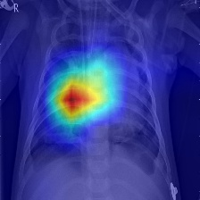
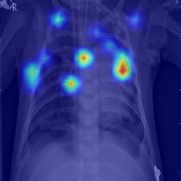

# Benchmarking Vision Transformers (ViT) vs. CNNs on Medical Imaging
### 046211 - Deep Learning Course Project | Technion


## 📌 Overview & Motivation

This project investigates a critical question in modern computer vision: **Can Vision Transformers (ViT) compete with established CNNs on limited-scale medical datasets?**

While Convolutional Neural Networks (CNNs) have long been the gold standard for medical image analysis due to their inductive bias (locality and translation invariance), Transformers have recently revolutionized the field. However, ViTs are known to be "data-hungry".

We benchmark three architectures—**ResNet50**, **DenseNet121**, and **ViT-Base**—on the task of **Pneumonia Detection** using Chest X-Ray images. Beyond simple accuracy, we explore:
1.  **Training Stability:** How different architectures behave with limited data (~5k images).
2.  **Hyperparameter Sensitivity:** Using **Optuna** to find the "Sweet Spot" for each model.
3.  **Robustness:** Ablation studies on data augmentation and optimizers (SGD vs. AdamW).
4.  **Explainability:** Visualizing model focus using **Grad-CAM** to detect where the models are "actualy looking at" and "Shortcut Learning".


##  Repository Structure
The repository is organized as follows:

```text
├── archive/                  # Legacy scripts and previous experiments
├── logs/                     # Training logs, optuna studies, and run outputs
├── results/                  # Generated analysis and figures
│   ├── heatmaps/             # Visualizations explainable heatmap
│   └── plots/                # Loss curves and comparison charts
├── models/                   # (Created during training) Saves model checkpoints
├── dataset.py                # Script to prepare the data for training
├── train.py                  # Main training script (Modular for all models)
├── explain_model.py          # Generates Heatmaps (GradCAM)
├── generate_final_plots.py   # Generates comparison graphs from logs
├── visualize_results.py      # Script for plotting individual training curves
├── visualize_deep_metrics.py # Advanced metric analysis
├── optuna_search.py          # Hyperparameter tuning script
├── requirements.txt          # Python dependencies
└── README.md                 # Project documentation
```

## 🔬 Methodology

### 1. Dataset
* **Source:** [Kaggle Chest X-Ray Images (Pneumonia)](https://www.kaggle.com/datasets/paultimothymooney/chest-xray-pneumonia)
* **Size:** 5,856 Images (JPEG).
* **Class Imbalance:** 74.3% Pneumonia / 25.7% Normal.
* **Preprocessing:** Resize to 224x224, Normalization (ImageNet stats).
* **Split Strategy:** We implemented a custom **90%  / 10%** split (Train/Val) to fix the original dataset's flawed validation set.

### 2. Model Architectures
We compared three distinct paradigms initialized with **ImageNet** weights (Transfer Learning):

| Architecture | Parameters | Inductive Bias | Key Characteristic |
| :--- | :--- | :--- | :--- |
| **ResNet50** | ~25M | Strong | Residual connections preventing vanishing gradients. |
| **DenseNet121** | ~8M | Strong | Feature reuse via dense connections; parameter efficient. |
| **ViT-Base** | ~86M | Weak | Global Self-Attention; treats images as sequence of patches. |

### 3. Optimization Strategy
* **Loss Function:** `Weighted Cross-Entropy` (Weight ≈ 3.0 for "Normal" class) to effectively handle the class imbalance.
* **Optimizer:** `AdamW` (Adaptive Moment Estimation with Decoupled Weight Decay).
* **Hyperparameter Tuning:** We used **Optuna** to optimize Learning Rate and Batch Size (30 trials per model).

> **Key Discovery:** ViT required a significantly smaller Learning Rate (**~1e-5**) compared to CNNs (**~1e-4**) to prevent divergence, confirming its fragile loss landscape.

---

## 🚀 Installation & Usage

### Prerequisites
* Python 3.8+
* CUDA-enabled GPU (Recommended)

### 1. Installation
Clone the repository and install dependencies:

git clone https://github.com/YahavFrei/ViT-vs-CNN-medical-imaging.git

cd ViT-vs-CNN-medical-imaging

pip install -r requirements.txt

### 2. Hyperparameter Search (Optuna)
To reproduce the hyperparameter optimization process:

python optuna_search.py

### 3. Training a Model
The `train.py` script is **pre-configured with ready-to-run execution blocks** for all our experiments. No manual argument parsing is needed.

To run a specific experiment:
1. Open `train.py`.
2. Scroll to the bottom (`if __name__ == "__main__":` block).
3. **Uncomment** the specific `main()` call you want to run (and comment out the others).
4. Run the script:

python train.py

**Available Configurations inside `train.py`:**
* **Final Optimized Models:** Run the best versions of DenseNet121, ResNet50, or ViT (with optimized LRs).
* **Ablation Studies:** Ready-made lines to run "No Augmentation" or "SGD Optimizer" experiments.
* **Baseline:** Default settings for initial comparison.

### 4. Visualizing Explanations
Generate Grad-CAM or Attention Maps for trained models:

python explain_model.py

---

## 📈 Key Results & Analysis

### 🏆 Performance Benchmark (Test Set)
**DenseNet121** emerged as the superior model for this task, offering the best balance of precision and recall.

| Model | Accuracy | Recall (Sensitivity) | Precision | F1-Score |
| :--- | :---: | :---: | :---: | :---: |
| **DenseNet121** | **93.91%** | 98.97% | **91.90%** | **95.31%** |
| ResNet50 | 91.83% | 96.67% | 90.84% | 93.66% |
| ViT-Base | 88.94% | **99.49%** | 85.27% | 91.83% |

> **Insight:** While ViT achieved near-perfect Recall (caught almost all sick patients), it suffered from **"Hypersensitivity"**, generating many False Alarms (Low Precision). This makes it less suitable as a standalone diagnostic tool compared to DenseNet.

### 📉 Training Dynamics
* **CNNs:** Showed smooth, monotonic convergence patterns.
* **ViT:** Exhibited volatility and sharp spikes in the loss curve, even with optimized parameters. This empirically validates the theoretical claim that Transformers lack the stabilizing inductive bias of convolutions.

### 🧪 Ablation Studies (Robustness Check)
We performed rigorous testing to understand model behavior:

1.  **No Augmentation:**
    * ViT performance crashed by **~10%** without augmentation.
    * CNNs remained relatively stable (drop of ~3-4%).
    * *Conclusion:* ViT is highly dependent on data diversity/augmentation to generalize.

2.  **Optimizer Sensitivity (SGD vs AdamW):**
    * **ResNet50 + SGD:** Stable, but converged to a "safe" minimum (high recall, low precision).
    * **ViT + SGD:** Failed to converge (During the training got Accuracy of ~38%).
    * *Conclusion:* ViT requires adaptive optimizers like **AdamW** to navigate its complex, non-convex loss landscape.

---

### Confusion Matrices
Model performance breakdown by class (Normal vs. Pneumonia):

| ResNet50 | ViT (Transformer) |
|----------|-------------------|
|  |  |

## 🧠 Explainability (Opening the Black Box)

We visualized *where* the models were looking to diagnose Pneumonia using **Grad-CAM**.

| Model | Observation |
| :--- | :--- |
| **DenseNet121 & ResNet50** | **Focused Attention:** The CNN consistently focused strictly on lung opacities and boundaries. This correlates with radiological features. |
| **ViT-Base** | **Scattered Attention:** The ViT showed scattered attention across the image. |

| ResNet50 | ViT |
|------------------|-------------------|
|  |  |

---

## 📝 Conclusion
Our benchmark confirms that for **limited medical datasets (~5k images)**:

1.  **CNNs are still King:** DenseNet121 offers the most reliable, stable, and explainable performance.
2.  **ViT is Data-Hungry:** Despite Transfer Learning, it struggles with stability and precision without massive datasets or stronger regularization.
3.  **Efficiency Winner:** DenseNet121 achieved superior results with only **~8M parameters**, drastically outperforming ViT (**~86M params**). This proves that efficient architectural design (Feature Reuse) trumps raw model size for medical tasks.
4.  **Clinical Implication:** DenseNet is recommended as a reliable **screening tool**. ViT shows promise but requires ensemble methods to mitigate false positives.
5.  **Optimization Fragility:** Our experiments proved that ViT has a highly non-convex loss landscape. Unlike ResNet (which remained stable with SGD), **ViT collapsed** without adaptive optimizers (AdamW) and required a much lower Learning Rate to converge.
6.  **Vulnerability to Shortcut Learning:** Explainability maps revealed that the models can sometimes focused on **medical tubes/wires** rather than pathology. 
7.  **Dependency on Augmentation:** Ablation studies showed that ViT is highly brittle; removing data augmentation caused a **~10% drop** in accuracy, whereas CNNs remained robust.

---

## 🔮 Future Directions
While DenseNet121 proved to be the most reliable standalone model, our analysis suggests several promising avenues for future research:

1.  **Ensemble Learning:** Combining the high **Recall** of ViT (which catches almost all positive cases) with the high **Precision** of DenseNet could create a superior "Hybrid Expert" system.
2.  **Hybrid Architectures:** Exploring models like **CoAtNet** that structurally combine Convolutional layers (for local features) and Self-Attention (for global context) to get the best of both worlds.
3.  **Pre-training on Medical Data:** Instead of ImageNet (natural images), pre-training ViT on a massive medical dataset (like CheXpert) might mitigate its lack of inductive bias.

---

## 👥 Credits
* **Authors:** Yahav Freitag & Polina Pukh
* **Institution:** Technion - Israel Institute of Technology
* **Course:** 046211 - Deep Learning (Winter 2026)
