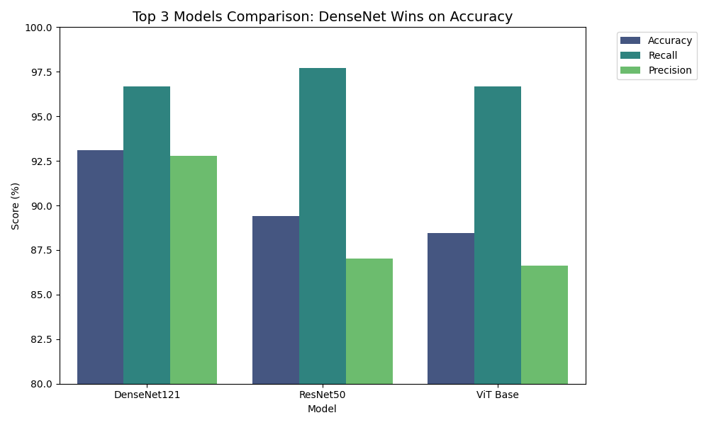
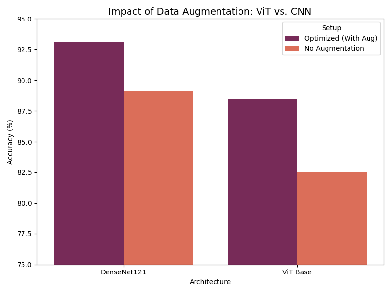
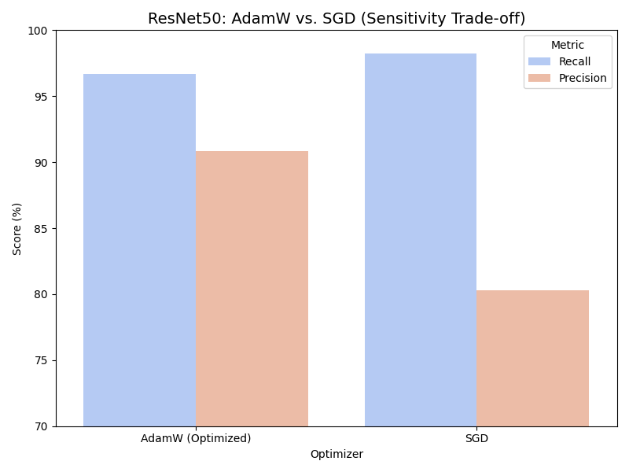

# Benchmarking Vision Transformers (ViT) vs. CNNs on Medical Imaging
### 046211 - Deep Learning Course Project | Technion


## Introduction
This project benchmarks the performance of **Vision Transformers (ViT)** against standard **Convolutional Neural Networks (CNNs)** (ResNet, DenseNet) for the task of **Pneumonia Detection** using Chest X-Ray images.

While CNNs have long been the gold standard for medical image analysis, Transformers have recently gained traction in computer vision. Our goal is to investigate:
1. **Performance:** Accuracy comparison between ViT, ResNet50, and DenseNet121.
2. **Data Efficiency:** How different architectures behave with limited medical data.
3. **Robustness:** The impact of data augmentation on convergence.
4. **Explainability:** Visualizing what the models "see" using GradCAM (for CNNs) and Attention Maps (for ViT).

##  Repository Structure
The repository is organized as follows:

```text
├── archive/                  # Legacy scripts and previous experiments
├── logs/                     # Training logs, optuna studies, and run outputs
├── results/                  # Generated analysis and figures
│   ├── heatmaps/24.01/       # Visualizations (GradCAM & Attention Maps)
│   └── plots/                # Loss curves and comparison charts
├── models/                   # (Created during training) Saves model checkpoints
├── dataset.py                # Script to download and prepare the Kaggle dataset
├── train.py                  # Main training script (Modular for all models)
├── explain_model.py          # Generates Heatmaps (GradCAM) and Attention maps
├── generate_final_plots.py   # Generates comparison graphs from logs
├── visualize_results.py      # Script for plotting individual training curves
├── visualize_deep_metrics.py # Advanced metric analysis
├── optuna_search.py          # Hyperparameter tuning script
├── requirements.txt          # Python dependencies
└── README.md                 # Project documentation

##  Installation

1. **Clone the repository:**
   ```bash
   git clone [https://github.com/YahavFrei/ViT-vs-CNN-medical-imaging.git](https://github.com/YahavFrei/ViT-vs-CNN-medical-imaging.git)
   cd ViT-vs-CNN-medical-imaging

2. **Create a virtual environment (Recommended):**
   ```bash
   conda create --name dl-project python=3.9 -y
   conda activate dl-project

3. **Install dependencies:**
   ```bash
   pip install -r requirements.txt  

## Dataset
We use the Chest X-Ray Images (Pneumonia) dataset from Kaggle.
Classes: Normal vs. Pneumonia
Source: [Kaggle Link](https://www.kaggle.com/datasets/paultimothymooney/chest-xray-pneumonia)

## Usage & Training
You can train different models by changing the arguments in train.py.
Hyperparameter Tuning (Optuna): To find the best parameters automatically - optuna_search.py.

## 📈 Results

### Performance Comparison
The following chart compares the validation accuracy and training time of the top models:



### Training Dynamics
We analyzed how different optimizers and augmentation techniques affect convergence:

| Impact of Augmentation | Optimizer Tradeoff |
|------------------------|--------------------|
|  |  |

### Confusion Matrices
Model performance breakdown by class (Normal vs. Pneumonia):

| ResNet50 | ViT (Transformer) |
|----------|-------------------|
|  |  |

## 🧠 Visualization & Explainability
To understand model decisions, we visualized the regions of interest:

* **ResNet50 (GradCAM):** Highlights local features (e.g., edges of the lungs).
* **ViT (Attention):** Captures global dependencies and focuses on larger areas.

| ResNet50 GradCAM | ViT Attention Map |
|------------------|-------------------|
|  |  |

## 👥 Credits
* **Authors:** Yahav Freitag & Polina Pukh
* **Paper Reference:** Dosovitskiy et al., "An Image is Worth 16x16 Words: Transformers for Image Recognition at Scale" (ICLR 2021).
* **Course:** Technion 046211 - Deep Learning.

